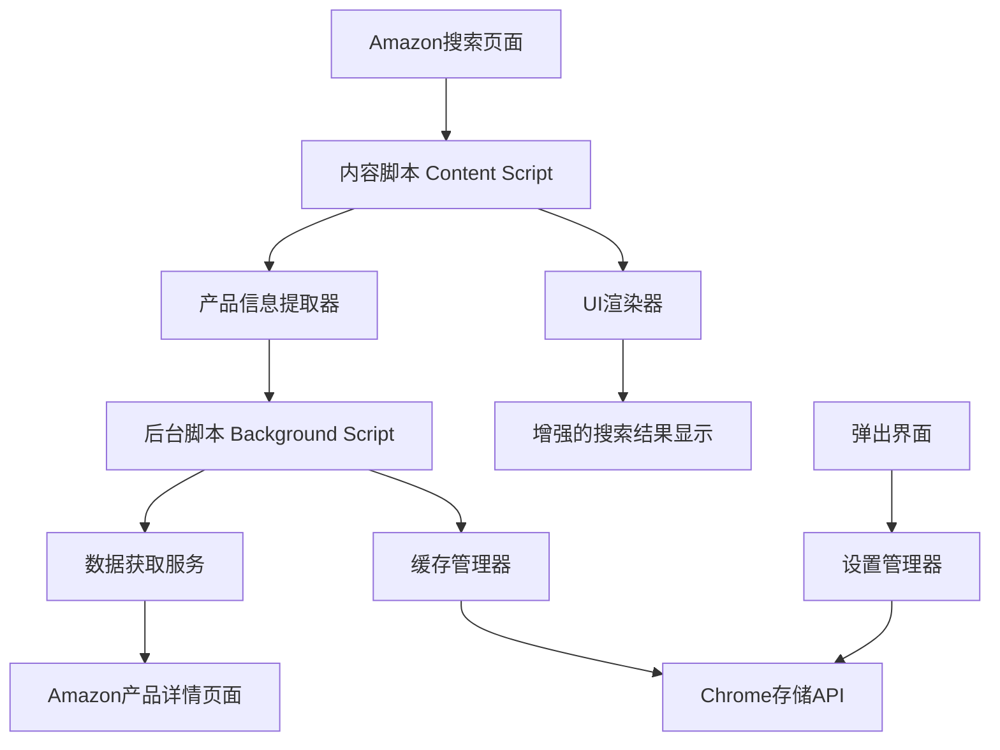

# 设计文档

## 概述

Amazon产品信息增强插件是一个Chrome浏览器扩展，通过内容脚本注入和后台数据处理，在Amazon搜索结果页面实时显示产品的关键信息。插件采用模块化架构，包含内容脚本、后台脚本、弹出界面和数据处理模块，确保高性能和良好的用户体验。

## 架构

### 整体架构图



### 核心组件

1. **内容脚本 (Content Script)**: 注入到Amazon页面，负责DOM操作和用户界面更新
2. **后台脚本 (Background Script)**: 处理跨域请求和数据管理
3. **弹出界面 (Popup)**: 提供用户设置和控制选项
4. **数据处理模块**: 解析和处理Amazon产品数据

## 组件和接口

### 1. 内容脚本 (content.js)

**职责:**
- 检测Amazon搜索结果页面
- 提取产品基本信息（链接、标题等）
- 向后台脚本请求详细产品信息
- 在页面上渲染增强信息

**主要接口:**
```javascript
class ProductEnhancer {
  // 初始化插件
  init()
  
  // 扫描页面产品
  scanProducts()
  
  // 请求产品详细信息
  requestProductDetails(asin, productUrl)
  
  // 渲染产品信息到页面
  renderProductInfo(productElement, productData)
  
  // 处理动态加载的产品
  handleDynamicContent()
}
```

### 2. 后台脚本 (background.js)

**职责:**
- 处理来自内容脚本的消息
- 发起跨域HTTP请求获取产品详情
- 管理数据缓存
- 处理用户设置

**主要接口:**
```javascript
class BackgroundService {
  // 处理消息
  handleMessage(message, sender, sendResponse)
  
  // 获取产品详细信息
  fetchProductDetails(productUrl)
  
  // 解析产品页面数据
  parseProductData(htmlContent)
  
  // 缓存管理
  cacheProductData(asin, data)
  getCachedData(asin)
}
```

### 3. 数据解析器 (parser.js)

**职责:**
- 解析Amazon产品详情页面HTML
- 提取BSR、ASIN、品牌、销售数据
- 处理不同页面布局和变体

**主要接口:**
```javascript
class AmazonParser {
  // 解析BSR信息
  parseBSR(htmlDoc)
  
  // 解析ASIN
  parseASIN(htmlDoc)
  
  // 解析品牌信息
  parseBrand(htmlDoc)
  
  // 解析销售数据
  parseSalesData(htmlDoc)
  
  // 解析产品变体
  parseVariants(htmlDoc)
}
```

### 4. UI渲染器 (ui-renderer.js)

**职责:**
- 创建和管理产品信息显示元素
- 处理不同的显示样式和布局
- 响应用户设置变化

**主要接口:**
```javascript
class UIRenderer {
  // 创建信息显示容器
  createInfoContainer(productElement)
  
  // 渲染BSR信息
  renderBSR(container, bsrData)
  
  // 渲染ASIN和品牌
  renderProductMeta(container, asin, brand)
  
  // 渲染销售数据
  renderSalesData(container, salesData)
  
  // 应用用户设置
  applyUserSettings(settings)
}
```

## 数据模型

### 产品数据模型
```javascript
interface ProductData {
  asin: string;
  title: string;
  brand: string | null;
  bsr: {
    rank: number;
    category: string;
  }[] | null;
  salesData: {
    boughtInPastMonth: number;
    totalVariants: number;
  } | null;
  variants: {
    asin: string;
    boughtInPastMonth: number;
  }[];
  lastUpdated: Date;
}
```

### 用户设置模型
```javascript
interface UserSettings {
  enabled: boolean;
  showBSR: boolean;
  showASIN: boolean;
  showBrand: boolean;
  showSalesData: boolean;
  cacheExpiry: number; // 小时
  maxConcurrentRequests: number;
}
```

### 缓存数据模型
```javascript
interface CacheEntry {
  data: ProductData;
  timestamp: number;
  expiry: number;
}
```

## 错误处理

### 1. 网络错误处理
- **连接超时**: 设置5秒超时，失败后显示"数据获取失败"
- **HTTP错误**: 根据状态码显示相应错误信息
- **解析错误**: 当页面结构变化时，优雅降级显示部分可用信息

### 2. 数据解析错误处理
- **缺失数据**: 对于无法获取的信息显示"不可用"
- **格式错误**: 实现容错解析，尝试多种解析策略
- **页面变化**: 使用多个CSS选择器作为备选方案

### 3. 用户体验错误处理
- **加载状态**: 显示加载指示器
- **错误反馈**: 提供清晰的错误信息和重试选项
- **性能保护**: 限制并发请求数量，防止页面卡顿

## 测试策略

### 1. 单元测试
- **数据解析器测试**: 使用真实Amazon页面HTML进行解析测试
- **缓存管理测试**: 验证缓存存储和过期逻辑
- **设置管理测试**: 测试用户设置的保存和加载

### 2. 集成测试
- **内容脚本集成**: 测试与Amazon页面的交互
- **后台脚本通信**: 验证消息传递机制
- **跨域请求测试**: 确保能正确获取产品详情

### 3. 端到端测试
- **完整流程测试**: 从搜索到信息显示的完整用户流程
- **性能测试**: 验证页面加载时间和响应速度
- **兼容性测试**: 测试不同Amazon页面布局和产品类型

### 4. 用户验收测试
- **真实场景测试**: 在实际Amazon搜索中验证功能
- **用户界面测试**: 确保信息显示清晰易读
- **设置功能测试**: 验证用户控制选项的有效性

### 测试数据准备
- 收集不同类型的Amazon产品页面HTML样本
- 准备包含各种BSR、品牌、销售数据的测试用例
- 创建边界情况测试数据（无BSR、无销售数据等）

### 自动化测试工具
- 使用Jest进行单元测试
- 使用Puppeteer进行端到端测试
- 使用Chrome扩展测试框架进行集成测试